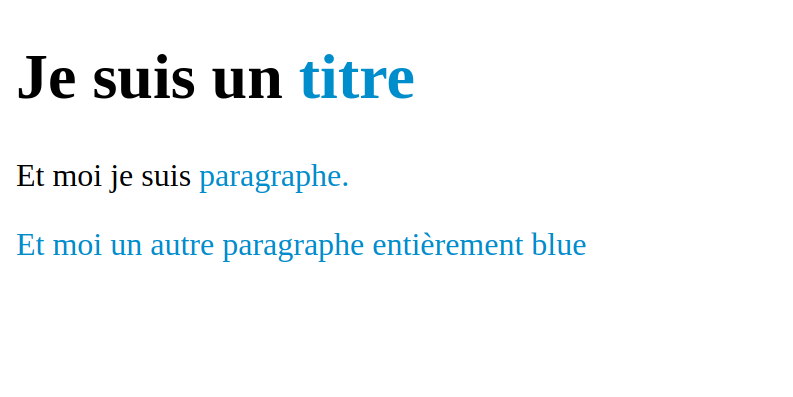

# session-5

## Aller plus loin avec les sélecteurs CSS

Jusqu'à présent nous avons principalement utilisé des sélecteurs simple qui reflêtaient
la structure des balises de votre pages.

```css
/* Personnaliser les liens <a>*/
a { }
/* Personnaliser les liens <a> contenus dans la balise <header> */
header a { }
/* Personnaliser les titres <h1>, <h2>, <h3>, <h4>, <h5> et <h6> */
h1, h2, h3, h4, h5, h6 { }
```

Sauf que parfois, utiliser la structure de la page pour cibler des éléments ne suffit pas
vous pouvez avoir besoin de styliser des éléments sans connaître leur context (ou leur parent).

### Les classes

À l'aide d'un attribut HTML, il est possible d'attribuer une `class` à n'importe quelle
balise. Grâce à cette `class` vous allez pouvoir définir un ensemble de règles qui ne
s'applique qu'à elle.

Pour définir une classe en HTML il faut utiliser l'attribut `class` :

```html
<h1 class="ma-class">Lorem ipsum dolor sit amet</h1>
```

Et en CSS pour désigner cette classe, il faut préfixer son nom avec un `.` :

```css
.ma-class {
  /* on définie les propriétés normallement */
}
```

Et enfin, un exemple plus complet :

```html
<!DOCTYPE html>
<html>
  <head>    
    <style>
      /* Toutes les balises ayant la class `info` s'afficheront en blue */
      .info {
        color: #3795C9;
      }
    </style>
  </head>
  <body>
    <h1>Je suis un <span class="info">titre<span></h1>
    <p>Et moi je suis <span class="info">paragraphe<span>.</p>
    <p class="info">Et moi un autre paragraphe entièrement blue</p>      
  </body>
</html>
```

Ce qui nous donne:

<kbd></kbd>

### Les ids

Ils ont un fonctionnement similaires aux classes mais servent à cibler un élément unique.
`id` est d'ailleurs l'abréviation de `identifier` et en informatique, les identifiants sont
par définission unique (attribué une seul fois). **Ça signifie qu'il est strictement
interdit de donner le même `id` à plusieurs balises.**

Pour donner à une blaise un `id` il suffit d'utiliser un attribut HTML :

```html
<span id="mon-id"></span>
```

Et en CSS pour désigner cet id, il faut préfixer son nom avec un `#` :

```css
#mon-id {
  color: #EED151;
}
```
