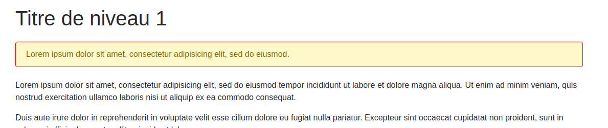
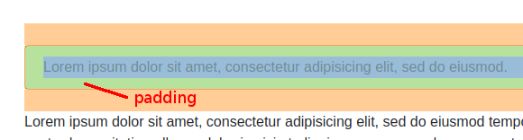
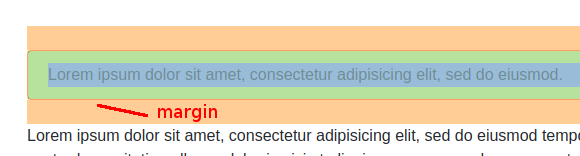

# session-5

## Préparation

- [ ] Forker ce projet dans votre espace personnel sur Github
- [ ] Cloner le fork dans Github Desktop

## Aller plus loin avec les sélecteurs CSS

Jusqu'à présent nous avons principalement utilisé des sélecteurs simple qui reflêtaient
la structure des balises de votre pages.

```css
/* Personnaliser les liens <a>*/
a { }
/* Personnaliser les liens <a> contenus dans la balise <header> */
header a { }
/* Personnaliser les titres <h1>, <h2>, <h3>, <h4>, <h5> et <h6> */
h1, h2, h3, h4, h5, h6 { }
```

Sauf que parfois, utiliser la structure de la page pour cibler des éléments ne suffit pas
vous pouvez avoir besoin de styliser des éléments sans connaître leur context (ou leur parent).

### Les classes

À l'aide d'un attribut HTML, il est possible d'attribuer une `class` à n'importe quelle
balise. Grâce à cette `class` vous allez pouvoir définir un ensemble de règles qui ne
s'applique qu'à elle.

Pour définir une classe en HTML il faut utiliser l'attribut `class` :

```html
<h1 class="ma-class">Lorem ipsum dolor sit amet</h1>
```

Et en CSS pour désigner cette classe, il faut préfixer son nom avec un `.` :

```css
.ma-class {
  /* on définie les propriétés normallement */
}
```

Et enfin, un exemple plus complet :

```html
<!DOCTYPE html>
<html>
  <head>    
    <style>
      /* Toutes les balises ayant la class `info` s'afficheront en blue */
      .info {
        color: #3795C9;
      }
    </style>
  </head>
  <body>
    <h1>Je suis un <span class="info">titre<span></h1>
    <p>Et moi je suis <span class="info">paragraphe<span>.</p>
    <p class="info">Et moi un autre paragraphe entièrement blue</p>      
  </body>
</html>
```

Ce qui nous donne:

<kbd></kbd>

### Les ids

Ils ont un fonctionnement similaires aux classes mais servent à cibler un élément unique.
`id` est d'ailleurs l'abréviation de `identifier` et en informatique, les identifiants sont
par définission unique (attribué une seul fois). **Ça signifie qu'il est strictement
interdit de donner le même `id` à plusieurs balises.**

Pour donner à une blaise un `id` il suffit d'utiliser un attribut HTML :

```html
<span id="mon-id"></span>
```

Et en CSS pour désigner cet id, il faut préfixer son nom avec un `#` :

```css
#mon-id {
  color: #EED151;
}
```

## Taille et marges

En CSS, il y a principalement deux types de balise: `block` et `inline`.

Les élément de type `inline` (span, a, strong, em, etc) ne sont jamais précédés ou suivis
d'un saut de ligne. On les retrouve généralement dans un corps de texte. Leur taille ne peut
être contraire.

Les éléments de type `block` (div, header, p, h1, h2, etc) sont toujours précédés et suivis
d'un saut de ligne. Par défaut, ils occupent toute la largeur de la page et peuvent contenir
des marges, des bordures ainsi que des tailles fixes, minimale ou maximal.

**Les indications qui suivent s'appliquent donc principalement aux éléments de type `block`.**

<kbd></kbd>

On l'a vu précédement, il est possible de spécifier la taille de certaines balises
en CSS. Mais la hauteur et la largeur ne sont pas les seules propriétés qu'il est
possible de définir pour changer l'aspect d'une balise.

### La marge interne (padding)

C'est la marge qui se situe à l'intérieur d'une balise, entre sa bordure et son contenu. En CSS, elle est définie à l'aide la propriété `padding`:

```css
.alert {
  padding-top: 5px;
  padding-bottom: 5px;
  padding-left: 5px;
  padding-right: 5px;
  /* ou en abrégé */
  padding: 5px;
}
```

Si on la met en surbrillance, le `padding` apparaît en jaune sur le block ci-dessous:

<kbd></kbd>

### La marge externe (margin)

C'est la marge qui se situe à l'extérieur d'une balise, après sa bordure? En CSS, elle est définie à l'aide la propriété `margin`:

```css
.alert {
  margin-top: 10px;
  margin-bottom: 10px;
}
```

Si on la met en surbrillance, le `margin` apparaît en organge sur le block ci-dessous:

<kbd></kbd>

### Définir des marges

On l'a vu, on peut définir des tailles coté par coté en CSS. Il existe aussi
quatres écritures abrégées qui s'appliquent au `padding` et au `margin` :

```css
.alert {
  /* les 4 cotés en même temps avec la même valuer */
  margin: 10px;
  /* la même valeur verticale (5px), la même valeur horizontale (10px) */
  margin: 5px 10px;
  /* valeur en haut (10px), la même valeur horizontale (5px), valeur en bas (20px) */
  margin: 10px 5px 20px;
  /* 4 valeurs différente (dans l'ordre: haut, droite, bas, gauche) */
  margin: 5px 10px 20px 10px;
}
```

### Tailles fixes

On peut fixer très simplement la taille d'une balise `block` en CSS :

```css
.alert {
  width: 300px;
  height: 300px;
}
```

Parfois, on veut utiliser des valeurs minimales et maximales plutôt qu'une taille fixe :

```css
.alert {
  /* la balise sera redimensionnable au dessus de 100px */
  min-width: 100px;  
  /* la balise sera redimensionnable au dessous de 700px */
  max-width: 700px;
}
```

## Positionner des éléments

### `static`

C'est le positionnement par défaut des éléments en HTML. Les éléments sont affichés
dans "le flow" c'est à dire les un à la suite des autres, à la ligne et en fonction
de leurs marges pour les balises de type block.

### `relative`

Ce type de positionnement permet de déplacer un élément par rapport à sa position d'origine
dans le flow. Contrairement à tous les autres types de positionnement, le positionnement
relatif ne déplacera pas les éléments qui entourent l'élément déplacé.
Pour utiliser le positionnement `relatif` :

```css
.alert {
  position: relative;
  /* Les propriétés top ou bottom indiquent le décalage vertical à appliquer
    et left ou right indiquent le décalage horizontal.  */
  top: 10px;
  left: 20px;
}
```

### `fixed`

Ce type de positionnement permet de déplacer un élément par rapport aux bords
de la fenêtre. Cela signifie que lorsque votre page contient beaucoup de contenu
et que vous utilisez la scrollbar, l'élément **restera fixé** au même endroit.
Pour utiliser le positionnement `fixed` :

```css
.alert {
  position: fixed;
  /* Les propriétés top, bottom, right et left indiquent les distances entre les
  bords de l'élément et les bords de la fenêtre.  */
  top: 0px;
  left: 0px;
}
```

### `absolute`

Ce type de positionnement est très similaire à `fixed`. Il vous permet de positionner
un élément par rapport à **l'élément l'englobant**. Dans la plupart des cas, l'élément
englobant est `<body>`. Cela signifie que si vous utilisez la scrollbar, l'élément ne sera
pas fixe. Pour utiliser le positionnement `absolute` :

```css
.alert {
  position: absolute;
  /* Les propriétés top, bottom, right et left indiquent les distances entre les
  bords de l'élément et l'élément l'englobant.  */
  top: 0px;
  left: 0px;
}
```

L'élément englobant est le premier parent de l'élément qui n'est pas défini en positionnement `static`.
